  

# 🚀 Awesome Streaming Real-Time Engagement

  
  
  
  
  

## 🌟 Top Streaming Real-Time Engagement Ecosystem

> **Curated List of SaaS Products & Open-Source GitHub Projects**  
> *Focused on Live Video, Real-Time Messaging, AI Voice Agents & Self-Hosted Engagement Platforms*  
> **Last updated: October 2026** 📅

---

### 📖 Overview & SEO Summary
Welcome to the definitive, curated awesome-list directory of **streaming real-time engagement (RTE)** platforms, low-latency **WebRTC SFU/MCU servers**, **real-time pub/sub messaging infrastructure**, and **interactive live video APIs**. 

Whether you are building ultra-low latency broadcasting apps (<500ms), sub-second AI conversational voice agents, or enterprise real-time chat, this directory provides comprehensive comparative data across commercial SaaS products and open-source tools.

**Key Technology Domains Covered:**
- 🎥 **WebRTC & Interactive Video Streaming** (SFU/MCU Routers)
- 🎙️ **Voice Calling & AI Voice Agents** (ChatGPT Advanced Voice Mode integrations)
- 💬 **Real-Time Pub/Sub Messaging & WebSockets** (SSE, DataChannels, MQTT)
- 📡 **Low-Latency Live Streaming Protocols** (RTMP, SRT, WebRTC-HTTP Egress WHIP/WHEP, LL-HLS, RTSP)

---

## 📑 Table of Contents

- [💼 SaaS/Hosted Platforms](#-saashosted-platforms)
- [🔓 Open-Source GitHub Projects](#-open-source-github-projects)
  - [📹 WebRTC & Real-Time Video Platforms](#-webrtc--real-time-video-platforms)
  - [⚡ Real-Time Messaging & Pub/Sub](#-real-time-messaging--pubsub)
  - [📡 Live Streaming & Multi-Protocol Servers](#-live-streaming--multi-protocol-servers)
  - [🛠️ Additional Open-Source Frameworks & Libraries](#️-additional-open-source-frameworks--libraries)
- [🤝 How to Contribute](#-how-to-contribute)
- [💖 Support & Sponsorship](#-support--sponsorship)
- [⚠️ Disclaimer](#%EF%B8%8F-disclaimer)
- [📊 Star History](#-star-history)

---

## 💼 SaaS/Hosted Platforms

> **📊 Market Size & Structure:** The global Real-Time Engagement (CPaaS & WebRTC) market is estimated at **~$15 Billion – $20 Billion** and is **moderately fragmented**, featuring enterprise incumbents alongside specialized infrastructure platforms.

| Product / Platform | Company Scale (Valuation / Revenue) | Starting Price (Paid Tier) | Free Tier / Trial Limit | Description |
| :--- | :--- | :--- | :--- | :--- |
| **[Salesforce Real-Time Engagement](https://www.salesforce.com/)** | **$186B Market Cap** ($41.5B Annual Rev) | $25/user/month | 30-day free trial (full environment access) | 🏢 Salesforce's real-time engagement platform — integrated with Salesforce CRM for omnichannel customer engagement. Best for Salesforce enterprise customers. |
| **[Twilio Live](https://www.twilio.com/)** | **$42B Market Cap** ($5.07B Annual Rev) | $0.004/video participant min ($0.001/audio min) | $15 – $25 free trial credit upon sign-up | 📞 Twilio's live streaming & real-time communication platform — low-latency interactive video integrated with Twilio APIs. Best for interactive live events. |
| **[Vonage Video API](https://www.vonage.com/)** | **$6.2B Acquisition** ($1.4B Annual Rev) | $0.0041/participant minute | 100,000 free minutes trial (75k video / 25k advanced) | 📹 Video API platform (formerly TokBox OpenTok) — embed live WebRTC video. Best for interactive enterprise video applications. |
| **[Ably](https://ably.com/)** | **$2.1B Valuation** ($18.3M Annual Rev) | $29/month (Standard Plan) | 6,000,000 messages/month & 200 concurrent connections | 🚀 Real-time messaging infrastructure — pub/sub with guaranteed delivery at scale. Best for mission-critical real-time messaging. |
| **[Sendbird Calls](https://sendbird.com/)** | **$1.1B Valuation** ($50M+ Annual Rev) | $399/month (Starter tier for up to 5k MAU) | Developer Plan: 100 MAUs free forever (or 30-day trial for 1,000 MAUs) | 📲 Voice and video calling API & SDKs — embed high-quality calling directly in mobile & web applications. Best for in-app communication. |
| **[Agora.io](https://www.agora.io/)** | **$345M Market Cap** ($160M+ Annual Rev) | $0.99 / 1,000 audio mins ($3.99 / 1,000 HD video mins) | 10,000 combined RTC minutes free every month | 🌐 Real-time engagement platform — voice, video, and interactive streaming with sub-second latency and SDKs for every major platform. Best for interactive live streaming & social apps. |
| **[PubNub](https://www.pubnub.com/)** | **$220M Valuation** ($40M+ Annual Rev) | $98/month (Starter plan up to 1,000 MAU) | 200 MAUs & 1,000,000 transactions/month free | ⚡ Real-time communication platform — pub/sub messaging, presence, and chat. Best for real-time applications at scale. |
| **[Daily.co](https://www.daily.co/)** | **~$150M Valuation** (Privately Held) | $0.004/participant minute (pay-as-you-go) | 10,000 participant minutes free every month | 🎥 Real-time video and audio APIs — embed video calls in applications with simple SDKs. Best for developer-friendly video integration. |
| **[Pusher](https://pusher.com/)** | **$35M Acquisition** ($1.5M+ ARR) | $49/month (Startup plan) | Sandbox plan: 200,000 messages/day & 100 concurrent connections | 📡 Real-time messaging platform — WebSocket-based pub/sub channels for applications. Best for developer real-time features. |

---

## 🔓 Open-Source GitHub Projects

Below is a sorted, comprehensive list of open-source real-time engagement repositories ordered by **GitHub Star Count (Descending)**.

### 📹 WebRTC & Real-Time Video Platforms

- **[Socket.IO](https://github.com/socketio/socket.io)**   
  ⚡ **Bidirectional event-based communication framework**, MIT licensed . **WebSocket engine with fallbacks to HTTP long-polling** . **Best for real-time web applications & chat** .

- **[SRS (Simple Realtime Server)](https://github.com/ossrs/srs)**   
  📺 **The leading open-source live streaming cluster server**, MIT/MulanPSL-2.0 licensed . **Supports RTMP, WebRTC, HLS, HTTP-FLV, SRT, MPEG-DASH** . **RTMP latency 0.8–3s; ultra-low latency mode ~0.1s** . **Scalable to millions of concurrent viewers** .

- **[Jitsi Meet](https://github.com/jitsi/jitsi-meet)**   
  📹 **The premier open-source video conferencing platform**, Apache-2.0 licensed . **WebRTC-based with scalable SFU (Jitsi Videobridge)** . **Embeddable via IFrame API & Mobile SDKs** .

- **[LiveKit](https://github.com/livekit/livekit)**   
  🤖 **End-to-end realtime stack for connecting humans and AI**, Apache-2.0 licensed . **Scalable, distributed WebRTC SFU written in Go using Pion** . **Powers ChatGPT's Advanced Voice Mode; used by Character.AI, Spotify, and Salesforce** . **Modern SDKs for JS, Swift, Kotlin, Flutter, React Native, and Rust** .

- **[NATS Server](https://github.com/nats-io/nats-server)**   
  ⚡ **Cloud-native high-performance messaging system**, Apache-2.0 licensed . **Lightweight pub/sub with JetStream engine for persistence & streaming** . **Best for IoT, edge computing, and real-time microservices** .

- **[MediaMTX](https://github.com/bluenviron/mediamtx)**   
  🎥 **Ready-to-use zero-dependency live media server & proxy**, MIT licensed . **Supports Media-over-QUIC, SRT, WebRTC, RTSP, RTMP, LL-HLS, and RTP** . **Automatic multi-protocol conversion in a single binary** .

- **[Janus WebRTC Server](https://github.com/meetecho/janus-gateway)**   
  🧩 **General-purpose WebRTC gateway**, GPL-3.0 licensed . **Plugin architecture for VideoRoom, SIP, Streaming, and DataChannels** . **Supports WebSockets, MQTT, RabbitMQ, and Data Channels** .

- **[Centrifugo](https://github.com/centrifugal/centrifugo)**   
  🚀 **Scalable real-time messaging server**, Apache-2.0 licensed . **Supports WebSockets, HTTP-streaming, SSE, and gRPC** . **Pub/sub channels with presence, history, and channel state recovery** .

- **[Pion WebRTC](https://github.com/pion/webrtc)**   
  🐹 **Pure Go implementation of WebRTC**, MIT licensed . **Non-blocking I/O API for building custom SFUs, MCUs, and WebRTC streaming tools** .

- **[mediasoup](https://github.com/versatica/mediasoup)**   
  ⚙️ **Cutting-edge WebRTC SFU library**, ISC licensed . **C++ core with Node.js/Rust signaling wrappers** . **Best for building custom low-level WebRTC applications** .

- **[Supabase Realtime](https://github.com/supabase/realtime)**   
  🗄️ **Listen to PostgreSQL database changes over WebSockets**, Apache-2.0 licensed . **Elixir-based real-time engine supporting Broadcast, Presence, and Postgres CDC** .

- **[Ant Media Server](https://github.com/ant-media/Ant-Media-Server)**   
  ⚡ **Ultra-low latency streaming engine (~0.5s WebRTC)**, Apache-2.0 licensed . **Supports WebRTC, SRT, RTMP, HLS, CMAF, and RTSP** .

- **[OvenMediaEngine](https://github.com/AirenSoft/OvenMediaEngine)**   
  🔥 **Sub-second latency live streaming server**, AGPL-3.0 licensed . **Supports WebRTC (OVT) and LL-HLS for large-scale high-definition streaming** .

- **[Jitsi Videobridge](https://github.com/jitsi/jitsi-videobridge)**   
  🌉 **WebRTC-compatible video router/SFU engine**, Apache-2.0 licensed . **Powers Jitsi Meet conference rooms with multi-party audio/video routing** .

- **[Mercure](https://github.com/dunglas/mercure)**   
  📡 **Open-source protocol & server for real-time web updates**, AGPL-3.0 licensed . **Built on Server-Sent Events (SSE) and HTTP/2 & HTTP/3** .

- **[OpenVidu](https://github.com/OpenVidu/openvidu)**   
  🛠️ **Developer-friendly WebRTC video platform**, Apache-2.0 licensed . **Complete SDKs for JS, React, Angular, Vue, iOS, Android, and Flutter** .

---

### 🛠️ Additional Open-Source Frameworks & Libraries
- 🔌 **[SocketCluster](https://github.com/SocketCluster/socketcluster)** — Scalable pub/sub framework for multi-core WebSocket servers.
- 🔄 **[Deepstream](https://github.com/deepstreamIO/deepstream.io)** — Fast real-time data synchronization server.
- 📦 **[Appwrite Realtime](https://github.com/appwrite/appwrite)** — Real-time subscription layer for web & mobile applications.
- 🪶 **[Primus](https://github.com/primus/primus)** — Universal wrapper for WebSocket frameworks.
- 💎 **[ActionCable](https://github.com/rails/rails)** — Integrated WebSocket framework for Ruby on Rails.

---

## 🤝 How to Contribute

Contributions are warmly welcome! Please follow these simple steps:

1. 🍴 **Fork** the repository.
2. 📝 **Add/edit** entries in [README.md](file:///C:/Users/hp/Documents/Projects/Awesome-Streaming-Real-Time-Engagement/README.md).
3. 🔗 Ensure all open-source repositories follow the GitHub star badge structure.
4. 🚀 Submit a **Pull Request** with a descriptive summary of your changes.

> Be sure to review the [Awesome-Awesome-Awesome Guidelines](https://github.com/ishandutta2007/Awesome-Awesome-Awesome) for quality standard references.

---

## 💖 Support & Sponsorship

If you find this real-time engagement ecosystem list helpful, please consider supporting the project! Your encouragement keeps the repository updated and well-maintained.

- ⭐ **Star this repository** to help others discover it.
- 🔀 **Fork & Share** with your engineering team and network.
- ☕ **Sponsor / Buy Me a Coffee**: If you'd like to support ongoing research and curation, consider supporting via the **[GitHub Sponsor Dashboard](https://github.com/sponsors/ishandutta2007)**.

  

---

## ⚠️ Disclaimer

- This directory is **community-curated** for informational and architectural evaluation purposes.
- Real-time video/audio streaming platforms process heavy bandwidth workloads. Self-hosted WebRTC SFU servers require TURN servers (e.g. Coturn) for NAT traversal and firewall compliance.
- Always review license compatibility (Apache-2.0, MIT, AGPL-3.0, GPL-3.0) prior to commercial production deployment.

---

## 📊 Star History

---

  <i>Built with ❤️ for real-time media engineers, WebRTC architects, and streaming developers.</i>

